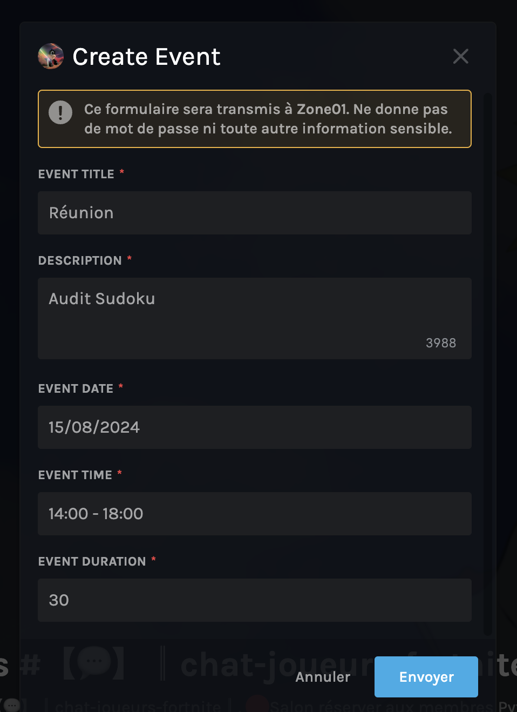

# Module de Gestion des Événements

Ce module, intégré au bot Discord Zone01, est responsable de la création et de la gestion des événements au sein du serveur Discord. Il permet aux utilisateurs de s'inscrire à des événements et offre aux administrateurs des outils pour gérer les inscriptions.

## Fonctionnalités

### Commande `/create_event`
- **Description** : Cette commande permet aux administrateurs de créer un nouvel événement. Un message avec un embed sera envoyé, contenant les détails de l'événement et les boutons d'interaction pour les utilisateurs et les administrateurs.
- **Utilisation** : `/create_event`
- **Paramètres** :
  - `nom_d'événement` : Le nom de l'événement.
  - `description` : La description de l'événement
  - `date` : La date de l'événement (format JJ/MM/AAAA).
  - `heures` : La plage horaire de l'événement (format HH:MM - HH:MM).
  - `durée` : La durée de chaque créneau horaire en minutes.

### Boutons d'Interaction

#### Bouton "S'inscrire" (✅)
- **Description** : Permet aux utilisateurs de s'inscrire à l'événement.
- **Fonctionnement** : 
  - Lorsqu'un utilisateur clique sur ce bouton, il est ajouté à la liste des participants avec un créneau horaire spécifique.
  - Si l'utilisateur est déjà inscrit, un message d'erreur est affiché.

#### Bouton "Effacer un étudiant" (🗑️)
- **Description** : Permet aux administrateurs de supprimer un utilisateur de la liste des participants.
- **Fonctionnement** :
  - Lorsqu'un administrateur clique sur ce bouton, le premier utilisateur de la liste est supprimé.
  - Le prochain utilisateur dans la liste est notifié pour son entretien.

#### Bouton "Supprimer l'embed" (🚫)
- **Description** : Permet aux administrateurs de supprimer le message embed de l'événement.
- **Fonctionnement** :
  - Lorsqu'un administrateur clique sur ce bouton, le message embed est supprimé et l'événement est effacé de la base de données.

#### Bouton "Clôturer les inscriptions" (🔒)
- **Description** : Permet aux administrateurs de clôturer les inscriptions pour l'événement.
- **Fonctionnement** :
  - Lorsqu'un administrateur clique sur ce bouton, le bouton d'inscription est désactivé, empêchant de nouvelles inscriptions.

### Exemple de Création d'Événement
- **Commande** : `/create_event` 
- Réunion Audit Sudoku 15/08/2024 14:00 - 18:00 30

- **Résultat** : Un message embed est créé avec les détails de l'événement et les utilisateurs peuvent commencer à s'inscrire.

### Notes
- Les administrateurs doivent avoir les permissions nécessaires pour utiliser les boutons de gestion.
- Les utilisateurs ne peuvent s'inscrire qu'une seule fois par événement.
- Les créneaux horaires sont calculés automatiquement en fonction de l'heure de début et de la durée spécifiée lors de la création de l'événement.
